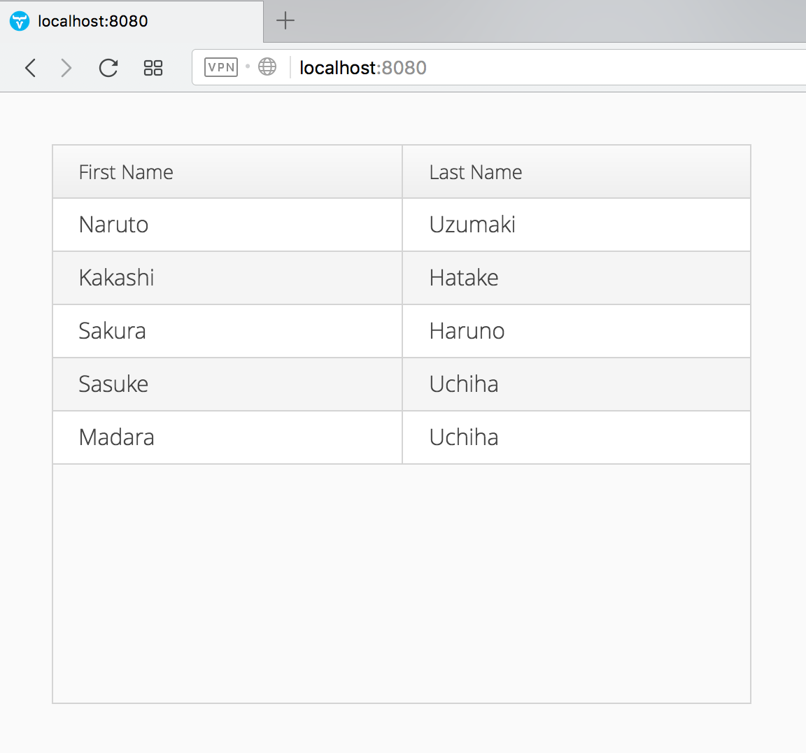

# MySQL and Vaadin integration example using Spring JDBC template

This example shows how to build a web UI for an existing MySQL database using plain Java.

Run this project by this command :

`mvn clean spring-boot:run`

### Screenshot

Home Page

